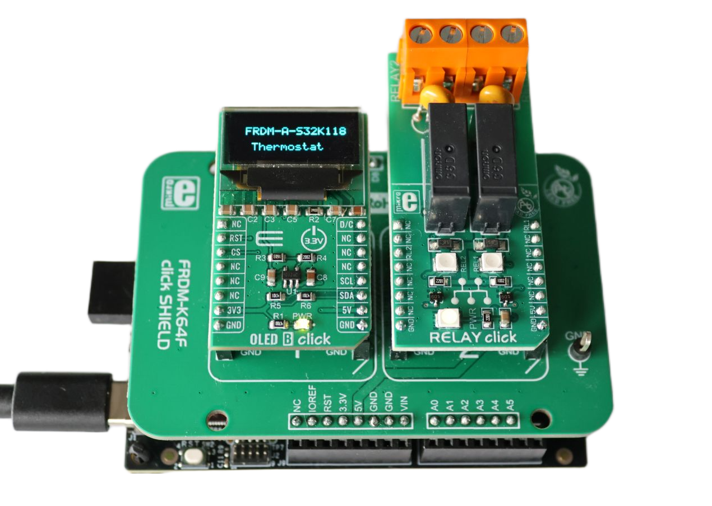
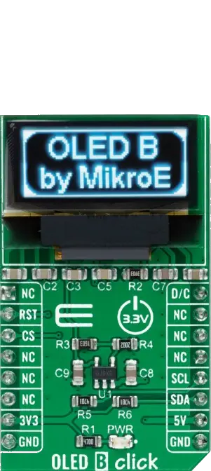
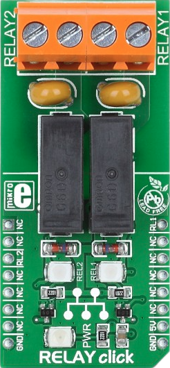
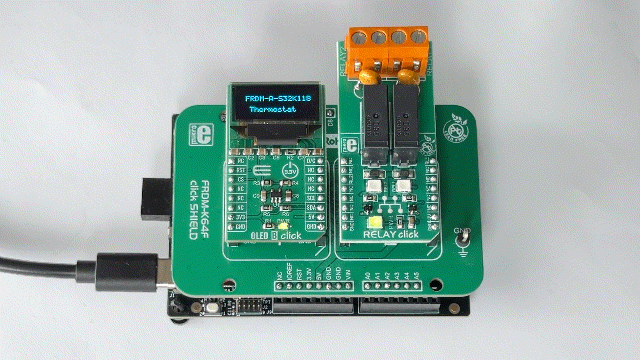

# NXP Application Code Hub

## Thermostat Controller with Relay and UART Reporting
This example demonstrates a compact thermostat controller running on the FRDM-A-S32K118 evaluation board. Ambient temperature is acquired from a PCT2075DP sensor over the FlexIO-based I2C interface and displayed on an SSD1306 OLED screen, while the LPUART peripheral periodically reports the system status to a host terminal. Based on a user-configurable setpoint with hysteresis, the application drives two GPIO-controlled relays for heating and cooling, and lets the user adjust the setpoint at runtime through the onboard SW3 and SW4 buttons.
[ ](./images/FRDM_A_S32K118_Relay_Thermostat.png)

#### Boards: FRDM-A-S32K118
#### Categories: User Interface, Sensor
#### Peripherals: I2C, FlexIO, UART, GPIO
#### Toolchains: S32 Design Studio IDE

## Table of Contents
1. [Software and Tools](#step1)
2. [Hardware](#step2)
3. [Setup](#step3)
4. [Results](#step4)
5. [Support](#step5)
6. [Release Notes](#step6)

## 1. Software and Tools
This example was developed using the FRDM Automotive Bundle for S32K1. To download and install the complete software and tools ecosystem, use the following link: 
- [ S32K1 FRDM Automotive Board Installation Package](https://www.nxp.com/app-autopackagemgr/automotive-software-package-manager:AUTO-SW-PACKAGE-MANAGER?currentTab=0&selectedDevices=S32K1&applicationVersionID=155)

## 2. Hardware
### 2.1 Required Hardware
- Personal Computer
- Type-C USB cable

| Boards | Images |
| ----------- | ------- |
| - [FRDM-A-S32K118](https://www.nxp.com/design/design-center/development-boards-and-designs/FRDM-A-S32K118) |  |
| - [FRDM K64 click shield](https://www.mikroe.com/frdm-k64-click-shield) | 

 |
| - [OLED B Click](https://www.mikroe.com/oled-b-click)   - [Relay Click](https://www.mikroe.com/relay-click)   | 
  |

### 2.2 Hardware Connections
| FRDM-A-S32K118   | Header Pin |I/O| FRDM Shield  | Click Board / Module | Pin       | Description        |
|------------------|------------|---|--------------|----------------------|-----------|--------------------|
| PTA14 FlexIO_D14 | J4 pin 17  | → | D14/SDA      | OLED B Click         | SDA       | FlexIO I2C SDA Pin |
| PTA9  FlexIO_D7  | J4 pin 19  | → | D15/SCL      | OLED B Click         | SCL       | FlexIO I2C SCL Pin |
| PTA14 GPIO       | J8 pin 8   | → | RST/A3       | OLED B Click         | RST       | Display reset      |
| PTA9 GPIO        | J4 pin 6   | → | CS/D10       | OLED B Click         | CS        | Display chip select|
| PTE8 GPIO        | J5 pin 12  | → | D5/PWM       | Relay 1              | RL1       | Relay 1 Command    |
| PTE9 GPIO        | J4 pin 3   | → | CS/D9        | Relay 2              | RL2       | Relay 2 Command    |
| GND              | JA3 pin 13 | → | GND          | All modules          | GND       | Ground             |
| VDD_PERH         | JA3 pin 7  | → | 3.3V         | All modules          | 3V3       | Power Supply       |

### 2.3 Debugger Connection
- Connect the Type-C USB cable to PC and FRDM-A-S32K118 board for power supply and debugging

## 3. Setup

### 3.1 Import the Project into S32 Design Studio IDE
1. Open S32 Design Studio IDE, in the Dashboard Panel, choose **Import project from Application Code Hub**.
   [

](./images/import_project_1.png)

2. Find the demo by searching: [dm-thermostat-relay-s32k118](https://mcuxpresso.nxp.com/appcodehub?search=dm-thermostat-relay-s32k118)
3. Open the project, click the **GitHub link**, S32 Design Studio IDE will automatically retrieve project attributes, then click **Next>**.
    [

](./images/import_project_3.png)

4. Select **main** branch and then click **Next>**.

5. Select your local path for the repo in **Destination->Directory:** window. The S32 Design Studio IDE will clone the repo into this path, click **Next>**.

6. Select **Import existing Eclipse projects** then click **Next>**.

7. Select the project in this repo (only one project in this repo) then click **Finish**.

### 3.2 Generating, Building and Running the Example
1. In Project Explorer, right-click the project and select **Update Code and Build Project**. This will generate the configuration (Pins, Clocks, Peripherals), update the source code and build the project using the active configuration (e.g. Debug_FLASH).
Make sure the build completes successfully and the *.elf file is generated without errors.
[

](./images/update_and_build.png)
Press **Yes** in the **SDK Component Management** pop-up window to continue.

2. Go to **Debug** and select **Debug Configurations**. There will be a debug configuration for this project:
[

](./images/Debug_config.png)

        Configuration Name                  Description
        -------------------------------     -----------------------
        $(example)_debug_flash_pemicro      Debug the FLASH configuration using PEmicro probe

    Select the desired debug configuration and click on **Debug**. Now the perspective will change to the **Debug Perspective**.
    Use the controls to control the program flow.

## 4. Results
The demo combines an NXP PCT2075DP temperature sensor with an SSD1306 OLED display and two GPIO-driven relays to deliver a compact, real-time thermostat controller:
[

](./images/FRDM_A_S32K118_Relay_Thermostat_Results.gif)

- **Startup Sequence:** On power-up, an initialization screen is shown on the OLED and a short relay self-test is performed. Both RL1 (heating) and RL2 (cooling) are activated in sequence so the user can visually and audibly confirm that both actuators are wired correctly, while status messages are streamed over UART.

- **Sensor Detection:** During initialization the PCT2075DP is probed on the I2C bus. If the sensor cannot be reached, a clear "ERROR" indicator is displayed on the OLED and an "ERROR - PCT2075DP NOT RESPONDING" message is printed over UART, and both relays are forced OFF, making connection issues easy to diagnose.

- **OLED Display Layout:** The main screen shows the controller title, the current temperature, the active setpoint, and a single combined relay-status line using the board relay labels (for example `RL1:OFF RL2:ON`), where RL1 is the heating relay and RL2 is the cooling relay. A footer hint reminds the user that SW3 increases and SW4 decreases the setpoint. Because heating and cooling are mutually exclusive, the status line always reflects a consistent state (RL1 is shown OFF whenever RL2 is ON).

- **Temperature Monitoring & Control:** The PCT2075DP is read periodically over the FlexIO-based I2C bus and compensated by a fixed offset to account for MCU board self-heating. The temperature is compared against the current setpoint with a 1 °C hysteresis band: below `setpoint - hysteresis` the heating relay (RL1) is turned ON, above `setpoint + hysteresis` the cooling relay (RL2) is turned ON, and inside the band both relays keep their previous state to avoid oscillations.

- **User Interaction:** The setpoint can be adjusted at runtime with the onboard buttons — **SW3** increases and **SW4** decreases the setpoint by 1 °C (bounded between 16 °C and 35 °C). The new setpoint is immediately reflected on the OLED and reported over UART.

- **UART Reporting:** Every few seconds a full monitoring report is sent over the LPUART peripheral (115200 8N1) containing the sensor status, current temperature, target setpoint, hysteresis thresholds and the state of both relays, providing an always-on log of the thermostat activity. Temperature values are printed using plain ASCII units ("deg C") to avoid character-encoding artifacts on host terminals.

## 5. Support
For general technical questions related to NXP microcontrollers, please use the *NXP Community Forum*.
#### Project Metadata

<!----- Boards ----->

<!----- Categories ----->

<!----- Peripherals ----->

<!----- Toolchains ----->

Questions regarding the content/correctness of this example can be entered as Issues within this GitHub repository.

>**Note**: For more general technical questions regarding NXP Microcontrollers and the difference in expected functionality, enter your questions on the [NXP Community Forum](https://community.nxp.com/)

## 6. Release Notes
| Version | Description / Update                           | Date                        |
|:-------:|------------------------------------------------|----------------------------:|
| 1.0     | Initial release on Application Code Hub        | August 17th 2026  |
